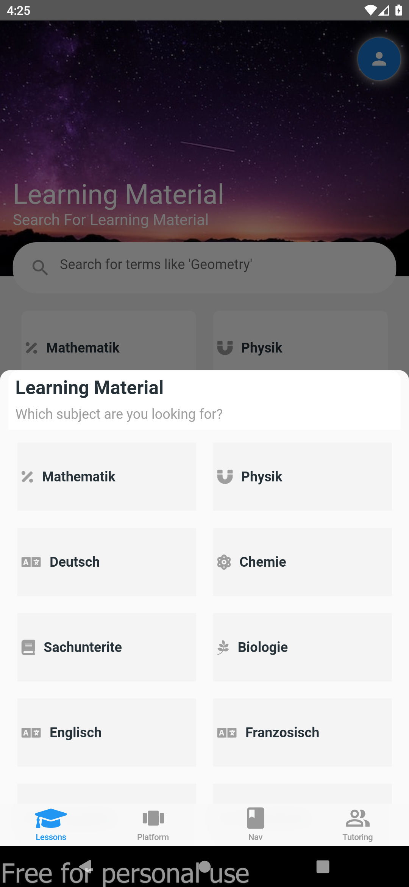
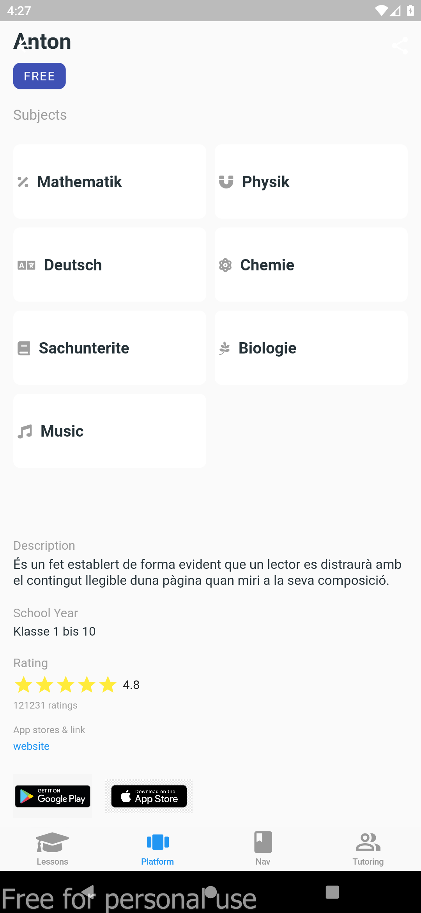

# Tutoring Application

- Learning application with amazing UI.
- Used custom widgets, libraries and clean code.
- Responsive in all mobile devices, tab and wide screens.

### Screenshots

 
 
 
 

#### Keep Fluttering :blue_heart:
